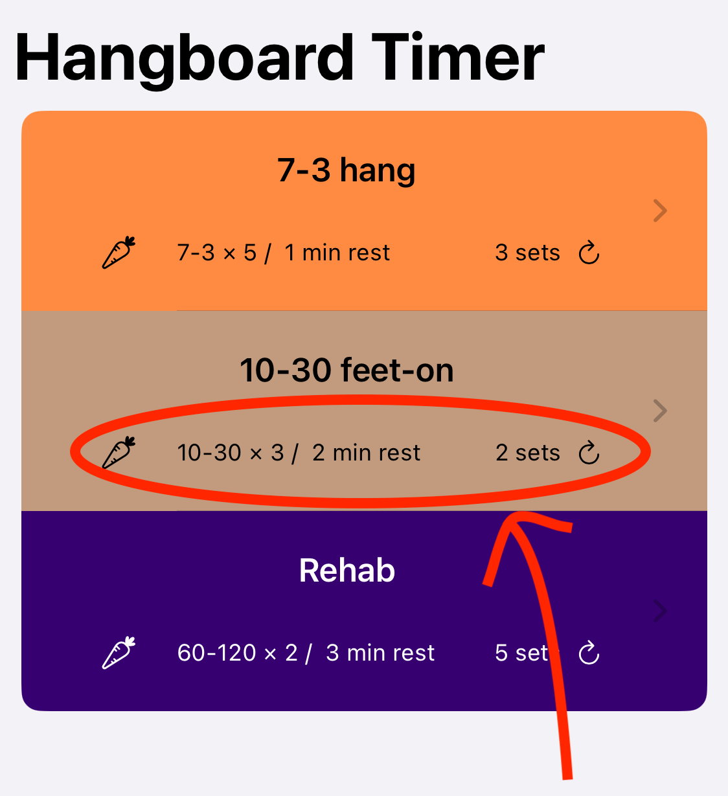

# Simple Hangboard Timer (iOS)

Basic to use interval timer app for rock climber training on the hangboard.

- [Simple Hangboard Timer (iOS)](#simple-hangboard-timer-ios)
  - [Quick Look](#quick-look)
    - [Easy to check](#easy-to-check)
    - [Configurable Intervals](#configurable-intervals)
    - [Friendly Interface](#friendly-interface)
  - [Installation](#installation)

## Quick Look

No-fuss as simple as possible solution, quick to launch, better focus.

### Easy to check

All informations are readily available as footnote, removing the need to create different names or checking the details everytime.

### Configurable Intervals

Hangboard timer should be simple; to create new timer climber only need to provide duration of hang/off/rest along with numnber of reps/sets.

### Friendly Interface

Brightly coloured with large font and no gimmics, easier glance and check progress

## Installation

App can be build into devices running iOS 16.6 and newer via xCode.

Beta testing available with testflight is wip.